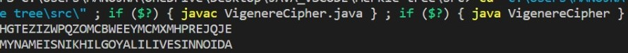

# Merkle Tree

## Introduction

hash tree or Merkle tree is a tree in which every "leaf" (node) is labelled with the cryptographic hash of a data block, and every node that is not a leaf is labelled with the cryptographic hash of the labels of its child nodes. It maintains data integrity and uses hash functions for this purpose. 
Let us understand whta is Hash functions

### Hash Functions: 

So before understanding how Merkle trees work, we need to understand how hash functions work. 
A hash function maps an input to a fixed output and this output is called a hash. 
The output is unique for every input and this enables fingerprinting of data. 
So, huge amounts of data can be easily identified through their hash. 

### Time and Space complexity of Merkle Tree

- The time complexity for searching is O(log n) because the time complexity for searching in a binary tree is O(log n).
- The time complexity for insertion is O(log n).
- The time complexity for deletion is O(log n).
- The space complexity is O( n ).

## The Architecture

## Algorithm

### Algorithm of find function in Merkle tree

- We will take the tree and key as parameters.
- If the tree is null then we will return null.
- If the tree->key is equal to the key we will return the tree.
- If the key is smaller than tree->key then we will return find(tree->left, key)
-  else return find(tree->right, key)

### Algorithm to add a node in Merkle tree.

- We will take key and value as parameters.
- Take the hash(key) and store it in a variable called index.
- store (struct node*) arr[ index ].head in a pointer called tree of datatype node.
- create a new node with its key as key and value as value and both links as null.
-  If the tree is null then assign the new node to the head and increment the size by 1.
- If the tree is not null then we will check if the key is already present in the tree using the find function.
- If the key is already present in the tree then we will update the value.
Step 8: If it is not present in the tree then we will use the insert function to insert the element.

### Algorithm of insert function.

- It will take tree and item pointers of node data type as parameters.
- If item->key is smaller than tree->key and tree->left is null then assign the item to tree->left.
- If item->key is smaller than tree->key and tree->left is not null then call insert function with tree->left and item as parameters.
- If item->key is greater than tree->key and tree->right is null then assign the item to tree->right.
-  If item->key is greater than tree->key and tree->right is not null then call insert function with tree->right and item as parameters.

### Algorithm to delete a node in Merkle tree.

- We will take a key as a parameter.
- Take the hash(key) and store it in a variable called index.
- store (struct node*) arr[index].head in a pointer called tree of datatype node.
- If the tree is null then the key is not present.
-  If the tree is not null then we will check if the key is already present in the tree using the find function.
- If the find function returns null then the key is not present in the tree.
- If it is not null then we will use the remove function to delete the element.

### Algorithm of remove function.

- It will take tree and key as parameters.
- If the tree is null then return null.
- If the key is smaller than the tree->key then tree->left is equal to remove(tree->left, key) and return tree.
- If the key is greater than the tree->key then tree->right is equal to remove(tree->right, key) and return tree.
-  else if the tree->left is equal to null and the tree->right is equal to null then decrement the size and return tree->left.
- else if the tree->left is not equal to null and the tree->right is equal to null then decrement the size and return tree->left.
- else if tree->left is equal to null and tree->right is not equal to null then decrement the size and return tree->right.
- else assign tree->left to a pointer called left of data type node.
- While left->right is not equal to null, left is equal to left->right.
- tree->key is equal to left->key.
- tree->value is equal to left->value.
- tree->left is equal to remove(tree->left, tree->key).
- Return tree.

## The Code

### VigenereCipher.java
    public class VigenereCipher {

	public static void main(String[] args) {
		
	String key = "VIGENERECIPHER";
    String ori = "My Name is Nikhil Goyal.I lives in NOida.";
    String enc = new VigenereCipher().encrypt(ori, key);
    System.out.println(enc);
    System.out.println(new VigenereCipher().decrypt(enc, key));

	}
	public String decrypt(String text, final String key) {
        String res = "";
        text = text.toUpperCase();
        for (int i = 0, j = 0; i < text.length(); i++) {
            char c = text.charAt(i);
            if (c < 'A' || c > 'Z') continue;
            res += (char)((c - key.charAt(j) + 26) % 26 + 'A');
            j = ++j % key.length();
        }
        return res;
    }
	
	public String encrypt(String text, final String key) {
        String res = "";
        text = text.toUpperCase();
        for (int i = 0, j = 0; i < text.length(); i++) {
            char c = text.charAt(i);
            if (c < 'A' || c > 'Z') continue;
            res += (char)((c + key.charAt(j) - 2 * 'A') % 26 + 'A');
            j = ++j % key.length();
        }
        return res;
    }
    } 

### MerkleTrees

    import java.security.MessageDigest;
    import java.util.ArrayList;
    import java.util.List;

    public class MerkleTrees {
	
	// A list of transaction
	List<String> txList;
	
	// Merkle Root
	String root;

	
	public MerkleTrees(List<String> txList) {
		this.txList = txList;
		root = "";
	}

	public void merkle_tree() {
		List<String> tempTxList = new ArrayList<String>();

		for (int i = 0; i < this.txList.size(); i++) {
			tempTxList.add(this.txList.get(i));
		}

		List<String> newTxList = getNewTxList(tempTxList);
		while (newTxList.size() != 1) {
			newTxList = getNewTxList(newTxList);
		}

		this.root = newTxList.get(0);
	}

	private List<String> getNewTxList(List<String> tempTxList) {

		List<String> newTxList = new ArrayList<String>();
		int index = 0;
		while (index < tempTxList.size()) {
			// left
			String left = tempTxList.get(index);
			index++;

			// right
			String right = "";
			if (index != tempTxList.size()) {
				right = tempTxList.get(index);
			}

			// sha2 hex value
			String sha2HexValue = getSHA2HexValue(left + right);
			newTxList.add(sha2HexValue);
			index++;

		}

		return newTxList;
	}

	/**
	 * Return hex string
	 * 
	 * @param str
	 * @return
	 */
	public String getSHA2HexValue(String str) {
		byte[] cipher_byte;
		try {
			MessageDigest md = MessageDigest.getInstance("SHA-256");
			md.update(str.getBytes());
			cipher_byte = md.digest();
			StringBuilder sb = new StringBuilder(2 * cipher_byte.length);
			for (byte b : cipher_byte) {
				sb.append(String.format("%02x", b & 0xff));
			}
			return sb.toString();
		} catch (Exception e) {
			e.printStackTrace();
		}

		return "";
	}

	/**
	 * Get Root
	 * 
	 * @return
	 */
	public String getRoot() {
		return this.root;
	}

    } 

###  MerkleTest.java

    import java.util.ArrayList;
    import java.util.List;

    public class MerkleTest {
	public static void main(String[] args) {
		List<String> tempTxList = new ArrayList<String>();
		tempTxList.add("My");
		tempTxList.add("name");
		tempTxList.add("is");
		tempTxList.add("Nikhil");
		tempTxList.add("Goyal");

		MerkleTrees merkleTrees = new MerkleTrees(tempTxList);
		merkleTrees.merkle_tree();
		System.out.println("root : " + merkleTrees.getRoot());
	}
    } 

### CaesarCipher.java

    import java.util.*;

    class CaesarCipher {
	public static void main(String args[]) {
		Scanner sc = new Scanner(System.in);
		int shift, i, n;
		String str;
		String str1 = "";
		String str2 = "";
		System.out.println("Enter the plaintext");
		str = sc.nextLine();
		str = str.toLowerCase();
		n = str.length();
		char ch1[] = str.toCharArray();
		char ch3, ch4;
		System.out.println("Enter the value by which each letter of the string is to be shifted");
		shift = sc.nextInt();

		System.out.println();
		System.out.println("Encrypted text is");
		for (i = 0; i < n; i++) {
			if (Character.isLetter(ch1[i])) {
				ch3 = (char) (((int) ch1[i] + shift - 97) % 26 + 97);
				// System.out.println(ch1[i]+" = "+ch3);
				str1 = str1 + ch3;
			} else if (ch1[i] == ' ') {
				str1 = str1 + ch1[i];
			}
		}
		System.out.println(str1);

		System.out.println();
		System.out.println("Decrypted text is");

		char ch2[] = str1.toCharArray();
		for (i = 0; i < str1.length(); i++) {
			if (Character.isLetter(ch2[i])) {
				if (((int) ch2[i] - shift) < 97) {
					ch4 = (char) (((int) ch2[i] - shift - 97 + 26) % 26 + 97);

				} else {
					ch4 = (char) (((int) ch2[i] - shift - 97) % 26 + 97);
				}
				str2 = str2 + ch4;
			}

			else if (ch2[i] == ' ') {
				str2 = str2 + ch2[i];
			}
		}
		System.out.println(str2);
	}
    }

## Output

## References

- [Introduction to Merkle Tree - GeeksforGeeks](https://www.geeksforgeeks.org/introduction-to-merkle-tree/)
- [Merkle Tree | Brilliant Math & Science Wiki](https://brilliant.org/wiki/merkle-tree/#:~:text=A%20Merkle%20tree%20is%20a,has%20up%20to%202%20children.)
- [Merkel Tree in Java. A Merkle tree is a data structure that… | by Vinay Prabhu | Medium](https://medium.com/@vinayprabhu19/merkel-tree-in-java-b45093c8c6bd)
 
